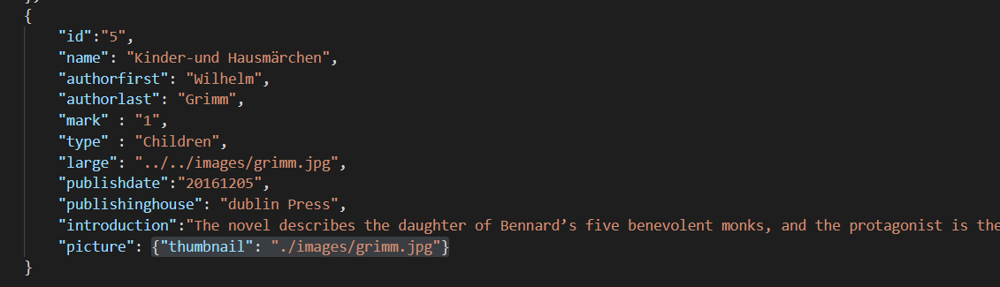
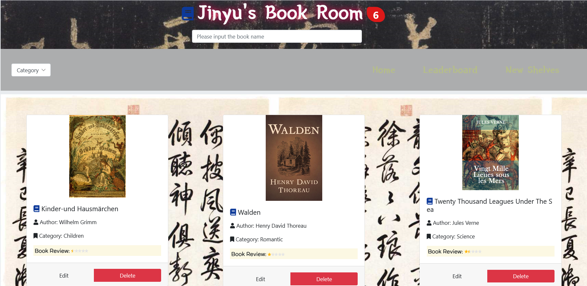
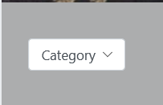
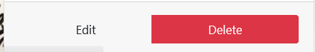
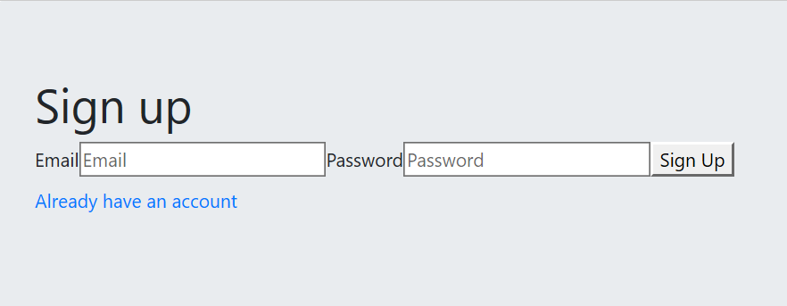
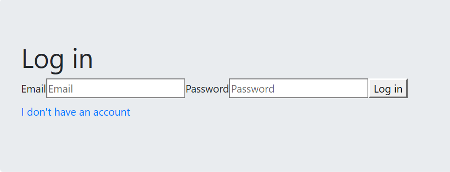
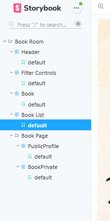

# BSc (Hons.) Level 8 - Assignment 1 - Library web page.

Name: Jinyu Chen

## Overview.

This is a library management web page , 
You can search the data of books stored in json files, 
edit them, or delete them. And you can access each book by clicking on the picture of each book, 
and view the book's content introduction and metadata.

. . . . . List of user features  . . . .

- Feature 1 : Search for bookname keywords on the search bar
- Feature 2 : Filter for differentiate between different types of books
- Feature 3 : Each book will have a different book review, combined in the form of a full star, half star, and empty star.
- Feature 4 : There are three buttons(Home, Leaderboard,new shelves) to handle the booklist sort as id, bookreview, publish date.
- Feature 5 : Firebase Authentication used for user sign up and user log in.

## Setup.

git clone https://github.com/271110962/ReactFirstAssignment.git

cd ReactFirstAssignment

npm install

npm start

## Data Model Design.

I used json to store data.

## UI Design.

>> Shows a book for each book in the dataChange. This book list can be filtered by name and categoty. A book can be edited or deleted a book. 

>> using the filter to connect the catogory selector and the searchbox, it will filter the data with the dataChangeApi, and render to the page, using the buttonconfig in the config folder to change the situation when you edit and delete, you can cancel whatever you choose.

>> The user need to sign up an account to login the home page, and all the information will store in the firebase authentication storage.

>> The user need to login using email and password if already have an account.

## Routing.

. . . . List each route supported by the app. For each one state the associated view and whether it's public/private (requires authentication) . . . . .

- /books/:id (private) - detail view of a particular book.
+ /books/:id/introduction(private) - display all information by a specific book.
+ /home - displays all public content, header,booklist,book,filterControls.
+ /login - login page
+ / - sign up page

## Storybook.

## Backend (Optional).

JSON file store the each book data: id, bookname, publish date, press, author, introduction for a book.

## Authentication (Optional).

using the firebase authentication which is the email and password authentication. It support signup and login. The encryption data will store in firebase storage.

## Independent learning.

using the Surge to deployed the app.  url:  needless-worm.surge.sh 

[data]: (./image/data.png)
[main]: (./img/main.png)
[detail1]: (./img/detail1.png)
[detail2]: (./img/detail2.png)
[detail3]: (./img/detail3.png)
[detail4]: (./img/detail4.png)
[detail5]: (./img/detail5.png)
[detail6]: (./img/detail6.png)
[stories]: (./img/stories.png)
